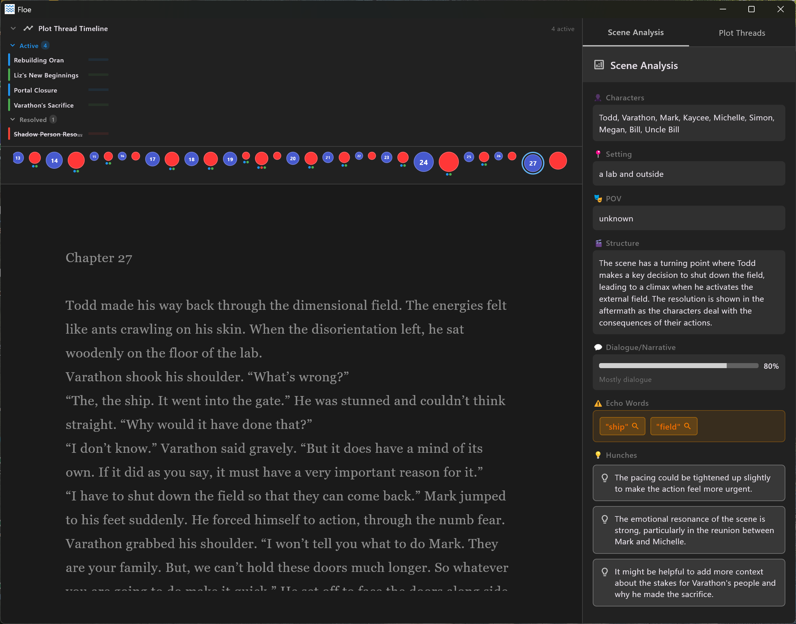

# Floe



An AI-powered writing companion for novelists. Floe provides real-time scene analysis with intelligent insights to help you craft better stories.

## Features

### 🎭 AI Scene Analysis
- **Flexible AI providers**: Choose between local Ollama or cloud-based OpenAI
- **Configurable AI models**: Select specific Ollama or OpenAI models in settings
- **Automatic scene detection** using standard manuscript formatting (two blank lines)
- **Real-time analysis** powered by your choice of AI
- Analyzes:
  - Characters present in the scene
  - Setting and time of day
  - Point of view and narrative tone
  - Stakes and emotional tension
  - Sensory details (sight, sound, touch, taste, smell)
  - Dialogue/narrative balance
  - Echo words (repeated words that may need attention)
  - Scene structure (inciting incident, turning points, crisis, climax, resolution)

### 💡 AI Hunches
- Get intelligent suggestions about:
  - Pacing and rhythm
  - Emotional resonance
  - Missing elements
  - Opportunities for improvement
  - Clarity and coherence

### 🧵 Plot Thread Tracking
- **Automatic detection** of plot threads across your manuscript
- **Smart categorization**: Main plot, subplots, character arcs, mysteries, conflicts, relationships
- **Thread lifecycle tracking**: Introduced, developing, resolved, or abandoned
- **Visual organization**: Grouped by status and type with color-coded indicators
- **Continuity monitoring**: Identifies potentially abandoned threads
- **Scene tracking**: See which scenes each thread appears in
- **Thread matching**: Intelligently matches thread variations across analyses

### ✍️ Distraction-Free Writing
- Clean, minimalist interface
- Focus mode that highlights current sentence
- Customizable fonts and line spacing
- Dark mode support
- Word count tracking
- Auto-save functionality (saves to Documents/Floe)

### 📊 Visual Story Tracking
- **Scene Information Panel**: Persistent right-margin analysis display with customizable fields
- **Bubble Chart Timeline**: Visual representation of your manuscript structure
  - Chapter and scene navigation
  - Word count visualization (bubble size)
  - Dialogue percentage tracking (bubble color)
  - Click any bubble to jump to that scene
  - Syncs with cursor position
  - Timeline strip shows current position
- **Plot Threads Panel**: Track all story threads in one organized view
  - Expandable groups by status (active, abandoned, resolved)
  - Type-based categorization with visual icons
  - Scene appearance tracking for each thread
  - One-click thread management (clear all)
- All panels hide automatically in fullscreen mode

## Requirements

### To Use Floe
- **Windows** (macOS and Linux builds available)
- **AI Provider** (choose one):
  - **Ollama** - Free, local, private AI (recommended for privacy)
  - **OpenAI** - Cloud-based AI with powerful models (requires API key)

### To Build from Source
- Flutter SDK 3.0.0 or higher
- Platform-specific development tools
- Git

## Installation

### Download Pre-built Binary
Download the latest release from the [Releases](https://github.com/keithbphillips/floe/releases) page.

- **Windows**: Extract `floe-windows.zip` and run `floe.exe`
- **macOS**: Mount `floe-macos.dmg` and drag to Applications
- **Linux**: Extract `floe-linux.tar.gz` and run the binary

### AI Provider Setup

#### Option 1: Ollama (Local AI - Free & Private)
1. Install [Ollama](https://ollama.ai)
2. Pull a model (recommended options):
   ```bash
   ollama pull llama3.2:3b      # Fast, 3B parameters (default)
   ollama pull qwen2.5:3b       # Alternative 3B model
   ollama pull llama3.2:1b      # Smaller, faster
   ```
3. Run Ollama (it starts automatically as a service)
4. Launch Floe - it will automatically detect Ollama
5. (Optional) Select a different model in Settings → Ollama Model

#### Option 2: OpenAI (Cloud AI - Requires API Key)
1. Get an API key from [OpenAI](https://platform.openai.com/api-keys)
2. Launch Floe
3. Open Settings (Ctrl+,)
4. Select "openai" as AI Provider
5. Enter your API key
6. Choose your preferred model (gpt-4o-mini recommended for speed and cost)

## Building from Source

```bash
# Clone the repository
git clone https://github.com/keithbphillips/floe.git
cd floe

# Get dependencies
flutter pub get

# Build for your platform
flutter build windows --release  # Windows
flutter build macos --release    # macOS
flutter build linux --release    # Linux

# The executable will be in build/<platform>/
```

## Usage

### Keyboard Shortcuts
- **Ctrl+M**: Insert em dash (—)
- **Ctrl+I**: Toggle italics
- **Ctrl+D**: Toggle dark mode
- **Ctrl+F**: Find and replace
- **Ctrl+,**: Open settings
- **Ctrl+Shift+A**: Force scene analysis
- **Ctrl+Shift+F**: Toggle focus mode
- **Ctrl+Shift+W**: Toggle word count
- **Ctrl+Shift+B**: Toggle bubble chart
- **Ctrl+Shift+P**: Toggle plot threads panel
- **F11**: Toggle fullscreen
- **Escape**: Close find dialog / Toggle menu bar

### Scene Breaks
Use **two blank lines** (press Enter 3 times) to separate scenes. Floe will automatically detect and analyze each scene independently.

### Automatic Analysis
Floe analyzes your writing automatically when:
- You stop typing for 5 seconds
- At least 50 words have been added
- At least 30 seconds have passed since the last analysis

Press **Ctrl+Shift+A** to force an immediate analysis.

## Configuration

Access settings with **Ctrl+,** to customize:
- **AI Provider**: Choose between Ollama (local) or OpenAI (cloud)
- **Ollama Model**: Select from installed models (llama3.2:3b, qwen2.5:3b, etc.)
- **OpenAI Settings**: API key and model selection (gpt-4o-mini, gpt-4o, etc.)
- **Scene Info Fields**: Toggle which analysis fields appear in the scene panel
- **Appearance**: Dark mode, fonts, font size, line height
- **Focus Mode**: Enable/disable and adjust intensity
- **Auto-Save**: Interval in seconds

### AI Models
- **Ollama**: Automatically detects installed models, defaults to llama3.2:3b
  - Recommended: llama3.2:3b, qwen2.5:3b, llama3.2:1b
  - Works with any Ollama-compatible model
- **OpenAI**: Supports gpt-4o-mini (recommended), gpt-4o, gpt-4-turbo, gpt-3.5-turbo

## Privacy

### With Ollama (Local)
- All AI processing happens **locally** on your machine
- No data is sent to external servers
- Your writing stays on your computer
- Completely free and private

### With OpenAI (Cloud)
- Scene text is sent to OpenAI's API for analysis
- Subject to [OpenAI's privacy policy](https://openai.com/policies/privacy-policy)
- Your API key is stored locally and never shared
- You control which provider to use

### Data Storage
- Auto-save files are stored in `Documents/Floe`
- Settings and API keys are stored locally using system-specific secure storage
- Plot threads are stored per-document using SharedPreferences
- No user data is ever included in the git repository or releases

## Roadmap

- [x] Windows support
- [x] OpenAI API integration
- [x] Dark mode
- [x] Focus mode
- [x] Plot thread tracking
- [x] Bubble chart visualization
- [x] Configurable AI models (Ollama & OpenAI)
- [x] Customizable scene info panel
- [ ] Export scene analysis reports
- [ ] Character tracking across documents
- [ ] Writing statistics and trends
- [ ] Custom scene break markers
- [ ] Project management features
- [ ] Additional AI provider support (Anthropic Claude, Google Gemini)

## Contributing

Contributions are welcome! Please feel free to submit a Pull Request.

## License

MIT License - See LICENSE file for details

## Acknowledgments

- Built with [Flutter](https://flutter.dev)
- AI powered by [Ollama](https://ollama.ai) and [OpenAI](https://openai.com)
- Fonts: Lora and IBM Plex Mono

---

**Floe** - Flow with your story
